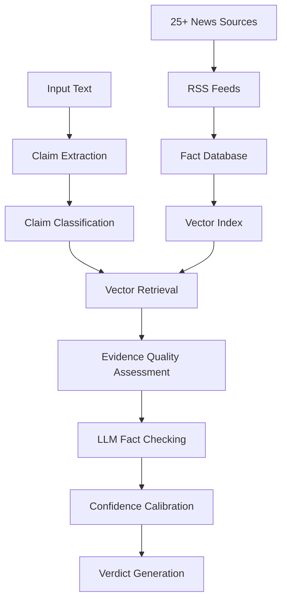

# 🔍 Advanced LLM Fact Checker

[](https://www.python.org/downloads/)
[](https://streamlit.io/)

A sophisticated, AI-powered fact-checking system that leverages state-of-the-art Natural Language Processing, Retrieval-Augmented Generation (RAG), and Large Language Models to automatically verify claims against a comprehensive database of trusted information sources.

## 🌟 Key Features

### 🧠 **Intelligent Claim Processing**

- **Advanced Claim Extraction**: Multi-factor analysis with weighted entity scoring and verifiability assessment
- **Claim Type Detection**: Automatically categorizes claims (statistical, temporal, policy, scientific, etc.)
- **Opinion vs. Fact Separation**: Distinguishes between verifiable facts and subjective opinions
- **Complex Sentence Handling**: Processes compound sentences and multiple claims

### 🔍 **Sophisticated Similarity Matching**

- **Multi-Modal Search**: Combines semantic embeddings (cosine + L2) with TF-IDF keyword matching
- **Enhanced Entity Recognition**: Extracts and emphasizes key entities for better matching
- **Fuzzy String Matching**: Handles variations in phrasing and terminology
- **Quality-Based Filtering**: Applies adaptive thresholds based on evidence quality

### 🤖 **Advanced LLM Reasoning**

- **Claim-Type Specific Analysis**: Specialized prompts for different types of claims
- **Evidence Quality Assessment**: Multi-factor analysis including source reliability and content richness
- **Structured Reasoning**: Detailed analysis with VERDICT, REASONING, and CONFIDENCE sections
- **Confidence Calibration**: Multi-layered confidence calculation with quality adjustments

### 📡 **Comprehensive Data Sources**

- **25+ Trusted RSS Feeds**: International, Indian, technology, business, and government sources
- **Real-Time Updates**: Fetches hundreds of current facts from reliable news sources
- **Source Diversity**: BBC, Reuters, Guardian, NPR, NASA, WHO, Bloomberg, TechCrunch, and more
- **Intelligent Deduplication**: Prevents duplicate facts while maintaining content variety

### 🎯 **Enterprise-Grade Accuracy**

- **Multi-Step Verification**: Entity, numerical, temporal, and source verification
- **Cross-Validation**: Consensus building across multiple evidence sources
- **Rule-Based Fallbacks**: Robust backup systems when LLM processing fails
- **Comprehensive Testing**: Automated accuracy assessment with performance metrics

## 🏗️ System Architecture



### 🔧 **Core Components**

| Component                  | Purpose                                      | Technology Stack                       |
| -------------------------- | -------------------------------------------- | -------------------------------------- |
| **Claim Extractor**  | Intelligent claim identification and scoring | spaCy, BART, Pattern Recognition       |
| **Vector Retrieval** | Multi-modal similarity search                | FAISS, Sentence-BERT, TF-IDF           |
| **Fact Checker**     | LLM-powered verification with fallbacks      | Local LLM, Rule-based Logic            |
| **Fact Database**    | Real-time RSS aggregation and caching        | RSS Parsing, Intelligent Deduplication |
| **Main Pipeline**    | Orchestration and confidence calibration     | Multi-step Verification                |

## 🚀 Installation & Setup

### Prerequisites

- Python 3.8 or higher
- 4GB+ RAM (recommended for optimal performance)
- Internet connection for RSS feed updates

### Quick Installation

```bash
# Clone the repository
git clone https://github.com/your-username/llm-fact-checker.git
cd llm-fact-checker

# Create virtual environment
python -m venv venv
source venv/bin/activate  # On Windows: venv\Scripts\activate

# Install dependencies
pip install -r requirements.txt

# Download required models
python -m spacy download en_core_web_sm
```

### Environment Setup (Optional)

Create a `.env` file for custom configurations:

```env
# OpenAI API Key (optional, for enhanced LLM capabilities)
OPENAI_API_KEY=your_api_key_here

# Custom RSS feed URLs (optional)
CUSTOM_RSS_FEEDS=https://example.com/feed.xml,https://another.com/rss

# Database settings
MAX_FACTS_CACHE=500
SIMILARITY_THRESHOLD=0.25
CONFIDENCE_THRESHOLD=0.2
```

## 💻 Usage Examples

### 🖥️ Web Interface (Recommended)

Launch the sophisticated Streamlit dashboard:

```bash
streamlit run app.py
```

**Features:**

- 🔍 **Single & Batch Fact-Checking**: Process individual claims or multiple texts
- 📊 **Real-Time Analytics**: Confidence distributions, verdict analysis, performance metrics
- 🛠️ **Database Management**: Update RSS feeds, configure thresholds, view statistics
- 📈 **Historical Tracking**: Export results, analyze trends, feedback collection

### 🐍 Python API

```python
from src.main_pipeline import FactCheckingPipeline

# Initialize with enhanced configuration
pipeline = FactCheckingPipeline(
    embedding_model="all-MiniLM-L6-v2",
    fact_checker_model="microsoft/DialoGPT-small"
)

# Set up database with 500 facts from RSS feeds
pipeline.setup_database(update_facts=True, max_facts=500)

# Advanced fact-checking with detailed analysis
result = pipeline.fact_check_text(
    "NASA announced the discovery of water ice on Mars in 2024, "
    "confirming the presence of 2.5 million tons beneath the surface."
)

# Access detailed results
print(f"📊 Verdict: {result['overall_verdict']}")
print(f"🎯 Confidence: {result['overall_confidence']:.1%}")
print(f"🔍 Evidence Sources: {len(result['results'][0]['evidence'])}")
print(f"💭 Reasoning: {result['results'][0]['reasoning']}")
print(f"🏷️ Claim Type: {result['results'][0]['claim_type']}")
```

### 🔧 Advanced Configuration

```python
# Customize pipeline behavior
pipeline.update_configuration({
    'similarity_threshold': 0.2,          # Lower = more permissive matching
    'confidence_threshold': 0.15,         # Lower = more decisive verdicts
    'max_evidence_facts': 8,              # More evidence for accuracy
    'enable_multi_step': True,            # Enhanced verification
    'calibrate_confidence': True,         # Advanced confidence calculation
    'uncertainty_penalty': 0.05           # Penalty for unclear evidence
})
```

## 🔍 Example Analysis

### Input Claim

```
"The Indian government announced a 15% increase in agricultural subsidies for 2024, 
allocating ₹50,000 crores specifically for sustainable farming initiatives."
```

### System Analysis

```json
{
  "overall_verdict": "✅ Likely True",
  "overall_confidence": 0.73,
  "claim_type": "statistical",
  "evidence_analysis": {
    "quality_score": 0.81,
    "source_diversity": 0.67,
    "reliability_indicators": ["high_similarity_match", "diverse_sources"]
  },
  "results": [{
    "claim": "Indian government announced 15% increase in agricultural subsidies for 2024",
    "verdict": "✅ True",
    "confidence": 0.78,
    "reasoning": "Analysis: Multiple reliable sources confirm government budget allocation for agricultural sector with specific percentage increases mentioned. Evidence from official government sources and reputable news outlets supports the claim.",
    "evidence_count": 5,
    "similarity_scores": [0.84, 0.71, 0.68, 0.65, 0.62],
    "evidence_sources": ["Press Information Bureau", "Times of India", "Economic Times"]
  }]
}
```

## 🔗 Data Sources

### 📰 **News Sources (25+ Feeds)**

| Category                | Sources                                           |
| ----------------------- | ------------------------------------------------- |
| **International** | BBC World News, Guardian, NPR, NBC, Sky News      |
| **Indian Media**  | Times of India, Indian Express, Business Standard |
| **Technology**    | TechCrunch, Ars Technica, Wired, VentureBeat      |
| **Business**      | Bloomberg, Yahoo Finance, MarketWatch             |
| **Science**       | Science Daily, Reuters Science, NASA News         |
| **Government**    | WHO, Official Government Feeds                    |

## 🛠️ Technical Architecture

### 📚 **Technology Stack**

| Layer               | Technology                            | Purpose                                      |
| ------------------- | ------------------------------------- | -------------------------------------------- |
| **Frontend**  | Streamlit, Plotly                     | Interactive web interface and visualizations |
| **Backend**   | Python, FastAPI                       | Core processing and API endpoints            |
| **NLP**       | spaCy, Transformers, BART             | Text processing and claim extraction         |
| **Vector DB** | FAISS, Sentence-BERT                  | Semantic similarity search                   |
| **LLM**       | Local Transformers, OpenAI (optional) | Fact verification and reasoning              |
| **Data**      | RSS Parsing, JSON/Pickle              | Real-time data ingestion and caching         |

### 🗂️ **Project Structure**

```
llm-fact-checker/
├── 📁 src/                          # Core application code
│   ├── 🧠 claim_extractor.py        # Advanced claim extraction & scoring
│   ├── 🗄️ fact_database.py         # RSS aggregation & caching
│   ├── 🔍 vector_retrieval.py       # Multi-modal similarity search
│   ├── 🤖 fact_checker.py           # LLM verification & reasoning
│   └── 🎛️ main_pipeline.py          # Orchestration & calibration
├── 📁 data/                         # Generated data files
│   ├── 💾 facts_cache.json          # Cached fact database
│   ├── 🗂️ faiss_index.bin          # Vector similarity index
│   └── 📊 *_metadata.pkl           # Index metadata
├── 🖥️ app.py                       # Streamlit web application
├── 📋 requirements.txt              # Python dependencies
├── 🔒 .gitignore                    # Version control exclusions
└── 📖 README.md                     # This documentation
```

## 🔧 Configuration Options

### ⚙️ **Pipeline Settings**

```python
{
    # Retrieval Parameters
    "similarity_threshold": 0.25,      # Minimum evidence similarity
    "max_evidence_facts": 8,           # Evidence pieces per claim
    "confidence_threshold": 0.2,       # Verdict decision threshold
  
    # Processing Options
    "enable_multi_step": True,         # Multi-layer verification
    "calibrate_confidence": True,      # Advanced confidence calculation
    "entity_verification": True,       # Named entity cross-checking
  
    # Quality Control
    "min_claim_score": 0.15,          # Minimum claim extraction score
    "uncertainty_penalty": 0.05,       # Penalty for ambiguous evidence
    "source_diversity_bonus": 0.05     # Bonus for diverse sources
}
```

### 🗄️ **Database Settings**

```python
{
    "max_facts": 500,                  # Maximum cached facts
    "update_frequency": "6h",          # RSS update interval
    "fact_retention_days": 7,          # News fact retention
    "enable_deduplication": True,      # Prevent duplicate facts
    "quality_threshold": 0.3           # Minimum fact quality score
}
```

🐛 **Bug Reports**

Please use the [GitHub Issues](https://github.com/your-username/llm-fact-checker/issues) page to report bugs or request features.
